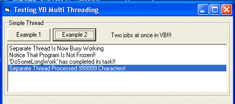



## VB MultiThreading\!\!

### Description

Now you to can multi thread in VB with ActiveX Exe using the power of COM. Simple and easy to use, no cryptic API, GPF's or a sea of classes. Youll be multithreading in Minutes With This Project!!
 
### More Info
 

             |
---                |---
**Submitted On**   |2003-11-06 08:19:58
**By**             |[Deth](https://github.com/Planet-Source-Code/PSCIndex/blob/master/ByAuthor/deth.md)
**Level**          |Intermediate
**User Rating**    |4.9 (34 globes from 7 users)
**Compatibility**  |VB 6\.0
**Category**       |[OLE/ COM/ DCOM/ Active\-X](https://github.com/Planet-Source-Code/PSCIndex/blob/master/ByCategory/ole-com-dcom-active-x__1-29.md)
**World**          |[Visual Basic](https://github.com/Planet-Source-Code/PSCIndex/blob/master/ByWorld/visual-basic.md)
**Archive File**   |[VB\_MultiTh1668391162003\.zip](https://github.com/Planet-Source-Code/deth-vb-multithreading__1-49688/archive/master.zip)

